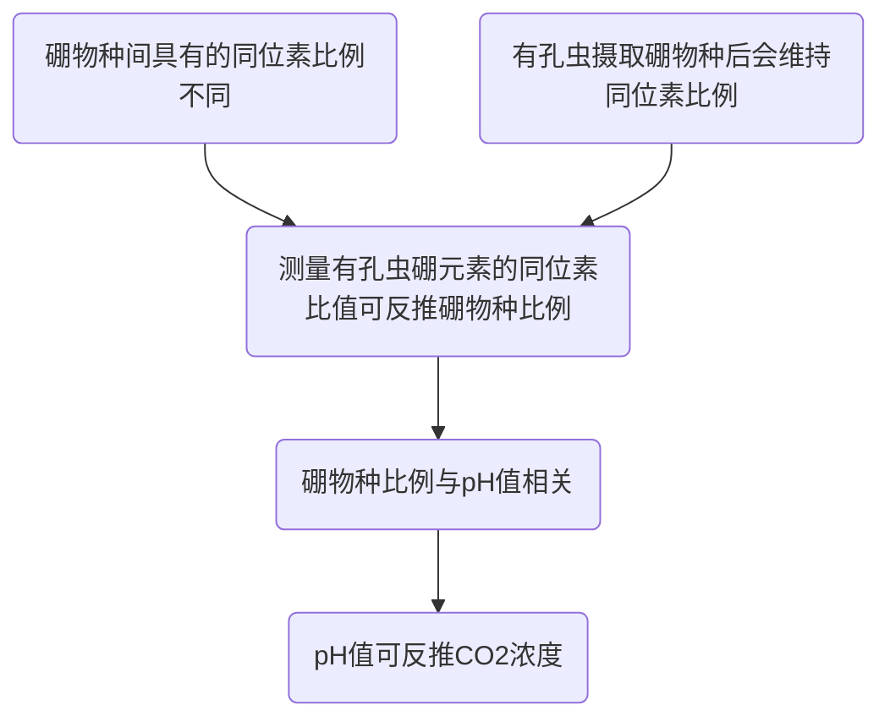

# 有孔虫壳体硼同位素

Isotopic Boron in Foraminifera Shell Composition

许智翔 元培学院

6 March, 2024

		<carbon:earth-europe-africa-filled class="inline text-stone-600"/>	
     地球系统演化 

---
layout: image-left
image: './BG_Forams_colored.png'
transition: slide-up
---

# 目录

<Toc maxDepth="1"></Toc>

---
transition: slide-left
---

# 基本原理

>硼元素在水中存在如下平衡:
> $$
> \displaystyle{\ce{
>  B(OH)3 + H2O <--> B(OH)4^- + H+ 
> }}
> $$
> $$
> \displaystyle{\ce{
>  ^{10}B(OH)3 + ^{11}B(OH)4^- <--> ^{11}B(OH)3 + ^{10}B(OH)4^- 
> }}
> $$

 

<Citation src="(Royer et al., 2001)"/>

---
transition: slide-left
---

# 有孔虫

_Foraminifera_, Forams

- 单细胞海洋底栖生物

- 身被主要成分为碳酸钙 $\ce{CaCO3}$ 的钙质壳体，较重，易沉积形成化石

- 化石记录始于寒武纪，迄今仍然存活，分布广泛

- 有孔虫吸收$\displaystyle{\ce{B(OH)4^-}}$时，基本不改变其硼同位素比例；  
化石可推断古代$\displaystyle{\ce{B(OH)4^-}}$中硼同位素之比

  
  
五玦虫 Quinqueloculina

---
transition: slide-left
hideInToc: true
---

# 记号引入：δ-记号
Delta Notation

自然界中的同位素含量的绝对值难以准确计算，故采用某某核素与常见同位数之比相对表示：

>$$
>  R = \cfrac{I_r}{I_a}
>$$
>其中 $\{(I_r, I_a) \space | \space (\ce{^2H},\ce{^1H}), (\ce{^{18}O},\ce{^16{O}}), \cdots\}$

 

在分析样品时，我们使用 δ-记号 表示其同位素比例相对“标准状态”的情况，记：

>$$
> \delta = \cfrac{R_{\text{sample}} - R_{\text{std}}}{R_{\text{std}}} \times 1000
> = (\cfrac{R_{\text{sample}}}{R_{\text{std}}}-1) \times 1000
>$$
>其单位为 ‰

---
layout: default
transition: fade
---

# 水中的硼元素

Boron In Water Bodies

  

  海洋中的硼以 $\displaystyle{\ce{B(OH)3}}$ 和 $\displaystyle{\ce{B(OH)4^-}}$ 的形式存在， 

  两者各有不同 $\cfrac{\delta \displaystyle{\ce{^{10}B}}} {\delta\displaystyle{\ce{^{11}B}}}$，并满足：

  > #1 **酸碱平衡**
  > $$
  > \displaystyle{\ce{
  >  B(OH)3 + H2O <--> B(OH)4^- + H+ 
  > }}
  > $$

   

  反应常数与pH值相关，并与温度负相关

  

  

    
    (Hemming & Hanson, 1992)
  

<Citation src="(Royer et al., 2001), (Hemming & Hanson, 1992)"/>

---
layout: default
transition: fade
hideInToc: true
---

# 水中的硼元素

Boron In Water Bodies

  

  海洋中的硼以 $\displaystyle{\ce{B(OH)3}}$ 和 $\displaystyle{\ce{B(OH)4^-}}$ 的形式存在， 

  两者各有不同 $\cfrac{\delta \displaystyle{\ce{^{10}B}}} {\delta\displaystyle{\ce{^{11}B}}}$，并满足：

  > #2 **同位素平衡**
  > $$
  > \displaystyle{\ce{
  >  ^{10}B(OH)3 + ^{11}B(OH)4^- <--> ^{11}B(OH)3 + ^{10}B(OH)4^- 
  > }}
  > $$
  > $K=1.0177$ (25°C)  
  > $Κ$ 随温度改变量很小，可忽略不计 

   

  这使得水中 $\ce{B(OH)3}$ 密度较大，$\ce{B(OH)4^-}$ 密度较小，  
  
  生物更倾向利用后者

  

  

    
    (Hemming & Hanson, 1992)
  

<Citation src="(Royer et al., 2001), (Hemming & Hanson, 1992)"/>

---
transition: fade
hideInToc: true
---

# 水中的硼元素

Boron In Water Bodies

<v-click>

> **同位素质量平衡 Isotopic Mass Balance** 
> $$
> \delta_{B4} x + \delta_{B3}(1-x) = \delta_{\sum B}
> $$
> 其中  
> $x = \cfrac{[\ce{B(OH)4^-}]}{[\ce{B(OH)3}] + [\ce{B(OH)4^-}]}$： $\ce{B(OH)4^-}$ 的摩尔分数  
> $\delta_{B4}$：$\ce{B(OH)4^-}$ 中的 $\delta\displaystyle{\ce{^{11}B}}$  
> $\delta_{B3}$：$\ce{B(OH)3}$ 中的 $\delta\displaystyle{\ce{^{11}B}}$

</v-click>

<Citation src="(Royer et al., 2001)"/>

---
layout: default
transition: fade
hideInToc: true
---

# 水中的硼元素

Boron In Water Bodies

> **同位素质量平衡 Isotopic Mass Balance** 
> $$
> \delta_{B4} x + \delta_{B3}(1-x) = \delta_{\sum B}
> $$

 

<v-click>

> **化学平衡 Chemical Equilibrium** 
> $$
> \cfrac{x \space [\ce{H+}]}{1-x} = K_B
> $$
> 其中 $K_b$ 为海水中的平衡常数

</v-click>

<v-click>

综合两式，消去 $x$ 得：

> $$
> [\ce{H+}] = K_b \space \cfrac{\delta_{\sum B} - \delta_{B4}}{\Delta_c - (\delta_{\sum B}-\delta_{B4})}
> $$

</v-click>

<Citation src="(Royer et al., 2001)"/>

---
layout: default
transition: fade
hideInToc: true
---

# 水中的硼元素

Boron In Water Bodies

> $$
> [\ce{H+}] = K_b \space \cfrac{\delta_{\sum B} - \delta_{B4}}{\Delta_B - (\delta_{\sum B}-\delta_{B4})}
> $$
> 其中 分馏系数 $\Delta_B = \delta_{B3} - \delta{B_4}$

<v-click>

给定几项假设：

- $\delta_{\sum B}$ 与 $\Delta_B$ 为常数，且其值与现代海洋相同
- $K_B$ 可以理论计算，盐度对$K_B$的影响在开阔大洋甚微
- 碳酸钙壳体只含$\displaystyle{\ce{B(OH)4}}$，吸收过程不存在同位分馏作用，或分馏系数为常量 $\Delta_C$ ，使得：  
$\delta_B(\ce{CaCO3}) = \Delta_C + \delta_{B4}$
</v-click>

<v-click>

那么，我们可以推导出 史前时期的pH值 

</v-click>

<Citation src="(Royer et al., 2001)"/>

---
layout: default
transition: slide-left
---

# 从古pH值到古CO2浓度

From Paleo-pH Values to Paleo-$\ce{CO2}$ Concentration 

<v-click>

假设理想情况:

“  溶解无机碳 (Dissolved Inorganic Carbon, DIC) 总量并没有随着时间改变 ”
</v-click>

<v-click>

若上述假设成立，则可以通过经温度修正的化学平衡，得出 $p_{\ce{CO2}}$ 与 pH、DIC的关系式，  
并利用现代的DIC值进行计算

但若DIC随着时间改变，那么就需要估计DIC的改变量，才能获得准确的$p_{\ce{CO2}}$

</v-click>

<Citation src="(Royer et al., 2001)"/>

---
transition: fade-out
---

# 问题

Caveats

### 温度相关性 <carbon-temperature-water class="inline text-rose-300" />

$K_B$ 和 $\Delta_B$ 实际上是温度 $T$ 的函数，需要古海洋的数据进行校正

 

### 硼同位素比例恒定假设 <ph-question class="inline text-indigo-300" />

上述推导假设 $\delta_{\sum B}$ 保持恒定，事实上 $\delta_{\sum B}$ 变化不小

相当部分海洋硼元素输入来自河源，而现代河流的$\ce{\delta^{11}B}$彼此差距可达 40‰，  
这引入很大的不确定性，影响程度或比pH值更大

如果固定河源输入呢？排除河源因素后，新生代的$\delta_{\sum B}$仍有2‰的变化，相当于$\Delta\text{pH} = 0.3$，  
 $p_{\ce{CO2}}$ 会有2 - 4 个数量级之差 

<Citation src="(Royer et al., 2001)"/>

---
transition: fade-out
hideInToc: true
---

# 问题

Caveats

### 硼元素结合入碳酸钙过程的分馏作用 <carbon-ibm-vsi-on-vpc-for-regulated-industries class="inline text-emerald-300" />

承上，定义此分馏作用的分馏系数为 $\Delta_C = \delta_B(\ce{CaCO3}) - \delta_{B4}$

对现代有孔虫的各研究得出的数据莫衷一是 ——  
既有认为所有有孔虫不分馏；也有认为均有较大程度的分馏；亦有认为部分种类分馏，部分种类不分馏的

本人倾向认为应当部分分馏，部分不分馏

对于有孔虫分馏相关机制，尚待进一步研究

化石记录方面，有研究者发现同一水深的不同有孔虫分馏系数一致，  
但当同一批研究者扩大样本范围时，较大波动出现

> **小结**  
> 这部分的机制和影响程度犹如盲盒，尚待进一步厘清

<Citation src="(Royer et al., 2001)"/>

---
transition: fade-out
hideInToc: true
---

# 问题

Caveats

### 成岩作用 <carbon-ibm-vsi-on-vpc-for-regulated-industries class="inline text-orange-300" />

成岩作用会让水中的 $\delta^{11}B$ 减少，影响总同位素比例。

研究者对大洋钻探计划 (Ocean Drilling Program, ODP) 的样品中的碳酸盐检验后，其$\delta^{11}B \in [-5.5‰, 23‰]$，低于平均值。

 

### 溶解无机碳DIC的量 <carbon-ibm-vsi-on-vpc-for-regulated-industries class="inline text-red-300" />

从古pH值推导古$\ce{CO2}$浓度，需假定大气$\ce{CO2}$和海洋$\ce{CO2}$之间存在平衡，但这是不可能的。

变质作用 (Metamorphism) 和岩浆活动 (Magmatism) 所引发的去气作用 (Degassing)，  
以及碳酸盐矿物和有机碳沉积的风化作用 (Weathering) 都会往系统输入$\ce{CO2}$

碳酸盐以及有机碳沉积的形成也则会令系统输出$\ce{CO2}$

这不单纯一个简单的系统。

<Citation src="(Royer et al., 2001)"/>

---
transition: slide-left
---

# 估计结果
Estimations

    
    (Hönisch et al., 2009)

<Citation src="(Hönisch et al., 2009)"/>

---
layout: center
transition: slide-up
---

# 思考题
Discussion

研究使用的有孔虫壳体，很多种属在现在已经是灭绝种属，会对恢复的准确性产生质疑吗？

如何将针对现代种属的校准结果应用于灭绝种属？

---
layout: center
transition: slide-left
hideInToc: true
---

# 思考题
Discussion

使用生物材料作为研究对象，如何衡量生命效应的影响？

---
layout: default
transition: slide-left
---

# 参考文献

References

1. Royer, D. L., Berner, R. A., & Beerling, D. J. (2001). Phanerozoic atmospheric CO2 change: Evaluating geochemical and paleobiological approaches. Earth-Science Reviews, 54(4), 349–392. https://doi.org/10.1016/S0012-8252(00)00042-8
2. Hemming, N. G., & Hanson, G. N. (1992). Boron isotopic composition and concentration in modern marine carbonates. Geochimica et Cosmochimica Acta, 56(1), 537–543. https://doi.org/10.1016/0016-7037(92)90151-8
3. Hönisch, B., Hemming, N. G., Archer, D., Siddall, M., & McManus, J. F. (2009). Atmospheric Carbon Dioxide Concentration Across the Mid-Pleistocene Transition. Science, 324(5934), 1551–1554. https://doi.org/10.1126/science.1171477
4. The Cenozoic CO Proxy Integration Project (CenCOPIP) Consortium*†, Hönisch, B., Royer, D. L., Breecker, D. O., Polissar, P. J., Bowen, G. J., Henehan, M. J., Cui, Y., Steinthorsdottir, M., McElwain, J. C., Kohn, M. J., Pearson, A., Phelps, S. R., Uno, K. T., Ridgwell, A., Anagnostou, E., Austermann, J., Badger, M. P. S., Barclay, R. S., … Zhang, L. (2023). Toward a Cenozoic history of atmospheric CO2. Science, 382(6675), eadi5177. https://doi.org/10.1126/science.adi5177
5. Dickson, A. G. (1990). Thermodynamics of the dissociation of boric acid in potassium chloride solutions from 273.15 to 318.15 K. Journal of Chemical & Engineering Data, 35(3), 253–257. https://doi.org/10.1021/je00061a009

---
layout: end
class: text-center
hideInToc: true
---

# 谢谢

欢迎针对前述内容提问～

