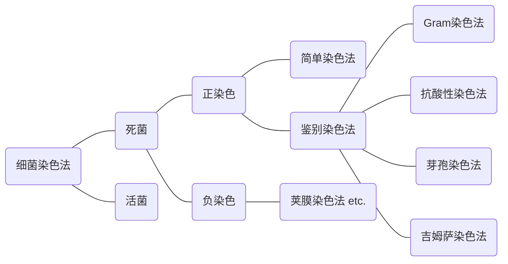

# 染色方法的分类
Types of Staining Method

```mermaid
flowchart LR
  a(细菌染色法) --- b1(死菌) & b2(活菌)
  b1 --- c1(正染色) & c2(负染色)
  c1 --- d1(简单染色法) & d2(鉴别染色法)
  c2 --- e5(荚膜染色法 etc.)
  d2 --- e1(Gram染色法) & e2(抗酸性染色法) & e3(芽孢染色法) & e4(吉姆萨染色法)
```

<Citation src="沈萍, 陈向东 (2016) "/>

